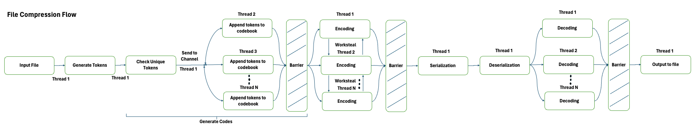
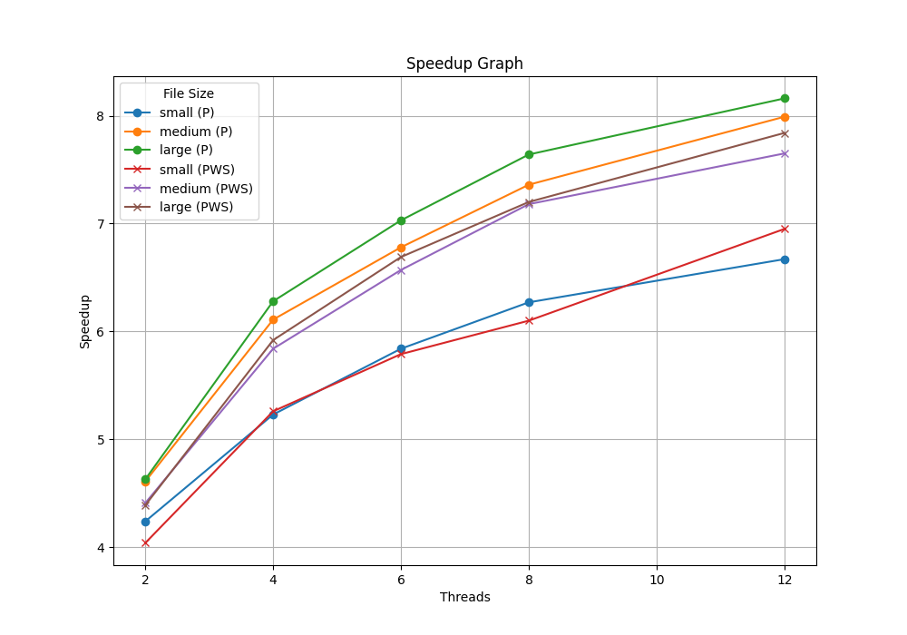

# Parallel File Compression



**Before running the program, download [Data](https://drive.google.com/drive/u/1/folders/1Pnki8B-Bd8vNHDUj26IoYeAGbYkQ8xY5) directory and put the folder under data directory accordingly as the file sizes are large and best to be downloaded separately.**

## Project Summary
File compression and decompression are nothing new. One can sequentially compress a file with ease, but what about a mega-size file? File compression process is dull and different parts of the file does not depend on each other, at least in the sense of their binary representation, not logically speaking. This gives a good opportunity for parallelism. In this project, I will tackle the file compression and decompression process, attempt to using multiple threads to parallelize it with bulk synchronous parallel (BSP) approach, combined with using Go channels to feed pipeline of tasks among different threads, and integrate work stealing deque algorithm to test the limits of parallelization. 

Generally speaking, the file compression and decompression process goes as follows:
1. Encoding
    - Take the input file and split the content in tokens.
    - Use the unique set of tokens to form a list of codebook.
    - Iterate through the tokens and look up the token's position in the codebook and store the index of token in the codebook in the encoded list, keeping their order/position unchanged. 
    - Serialize the codebook and encoded list into binary format to compress the content.
2. Decoding
    - Deserialize the binary representation of the compressed file back into codebook and encoded list. 
    - Decode the encoded list by using the codes and looking up the codebook to find the actual tokens. The result will be a list of original tokens. 
    - Output the original tokens to an output file.  

## Parallel Approach
To understand what can be parallelized, we first need to understand what parts of the program is IO-bound and what parts are CPU-bound. IO-bound tasks are those that spend most of their time waiting for input/output operations to complete. CPU-bound tasks are those that spend most of their time performing computations. IO-bound problems can be hard to parallelize because threads may need to wait for some IO operation to complete before they can proceed.

File compression is a perfect example to illustrate this - operations that involve reading and writing files are IO-bound, which cannot easily be parallelized. On the other hand, encoding and decoding processes are CPU-bound, which can be parallelized. 

I will now walk through the entire process and illustrate what can be parallelized and what cannot, and what approach I will take to parallelize the program. The workflow is illustrated in the flowchart at the top.

In the file compression process, there are four main steps:

1. First step is to read the input file and split the content into tokens. This is IO-bound and cannot be parallelized.
2. Second step is to form the codebook. This is CPU-bound and can be parallelized. The goal of this step is to form a unique set of tokens and put the unique tokens into the codebook slice for later lookup. This can be parallelized by splitting the tokens into chunks and assigning each chunk to a thread to form the codebook and wait for all threads to finish before proceeding to the next step, which is the standard BSP pattern. Instead of doing this, I attempted to approach this with a pipeling pattern having one main thread to go through the unique tokens, and once encountered a new token, I will send the token to a channel to be processed by other threads waiting on the other side of the channel to append to the codebook if they receive it. Once all tokens are processed, the main thread will close the channel and wait for all threads to finish before proceeding to the next step. This approach reduces the latency of waiting for the unique tokens to form the whole list before starting the process, and having multiple threads on the consumer end to wait for the channel increases the throughput as you can have multiple threads take up tasks from the channel while other threads are busy processing the tasks.
3. Third step is to encode the content. This is CPU-bound and would take O(N<sup>2</sup>) time to complete, thus a perfect candidate to be parallelized. The goal of this step is to iterate through the tokens and look up the token's position in the codebook and store the index of token in the codebook in the encoded list, keeping their order/position unchanged. This is parallelized by splitting the tokens equally into chunks and assigning each chunk to a thread to encode the tokens and wait for all threads to finish before proceeding to the next step, which is the standard BSP pattern. This is an example of balancing the workload among different threads.
Additionally, I applied a worksteal algorithm to the parallel encoding process to test the limits of parallelization and compared which parallel approach is better. First, I maintain a slice of DEQueue for each thread. Then, I have each thread pushbottom their own tasks into their own DEQueue. When a thread finishes its own tasks, it will attempt to steal tasks from other threads' DEQueue. This is done by randomly selecting a thread to steal from and pop the top task from the DEQueue. If the DEQueue is empty, the thread will try to steal from another thread. This process will continue until all threads finish their tasks. This approach keeps the workload balanced among different threads, if one thread is done and have capacity, it will take up task from another thread reducing the workload from that thread and raises the workload for the thread which is free and reduces the latency of waiting for all threads to finish before proceeding to the next step by increasing the throughput in a shorter period of time.

4. Fourth step is to serialize the codebook and encoded list into binary format to compress the content. This is IO-bound and cannot be parallelized, as it involves encoding the data into binary format and writing to a file.

In the file decompression process, there are three main steps:

1. First step is to deserialize the binary representation of the compressed file back into codebook and encoded list. This is IO-bound and cannot be parallelized.
2. Second step is to decode the encoded list by using the codes and looking up the codebook to find the actual tokens. The result will be a list of original tokens. This is CPU-bound and can be parallelized. The goal of this step is to iterate through the encoded list and look up the codebook to find the actual tokens and store the original tokens in a slice. This is parallelized by splitting the encoded list equally into chunks and assigning each chunk to a thread to decode the encoded list and wait for all threads to finish before proceeding to the next step, which is the standard BSP pattern. The load is balanced at the beginning by splitting the encoded list equally among different threads. Additionally, the latency of waiting for all threads to finish before proceeding to the next step is reduced by increasing the throughput of decoding in a shorter period of time.
I have attempted to apply worksteal algorithm to the decode process but realized fundamentally it does not make sense. All this does is to go through the encoded list O(N) and look up the codebook which takes O(1). If I were to apply worksteal algorithm, it would need to pushbottom the entire encoded list into the DEQueue, this would already take O(N) time, not to mention the actual processing time. Thus, I decided to not apply worksteal algorithm to the decode process.
3. Third step is to output the original tokens to an output file. This is again IO-bound and cannot be parallelized.

In summary, the file compression and decompression process leverage the use of BSP and pipeline pattern to parallelize the encoding and decoding process, and worksteal algorithm to attempt to optimize the program.

## WorkSteal Algorithm

Workstealing is a technique to balance the workload among different threads. The idea is to have each thread maintain a DEQueue of tasks. When a thread finishes its own tasks, it will attempt to steal tasks from other threads' DEQueue. This is done by randomly selecting a thread to steal from and pop the top task from the DEQueue. If the DEQueue is empty, the thread will try to steal from another thread. This process will continue until all threads finish their tasks. 

Workstealing is suitable for scenarios where you have imbalance of workload among threads, thus having some threads which finished their part go and steal tasks from other threads which are still busy. It is essentially load balancing among different threads. In this situation, in the encoding step, since threads will be looking up the codebook for the token position, which can be at the beginning or at the end of the codebook, their workload may vary ultimately, thus may be a good candidate to adopt workstealing. This is true but only partially. The problem I encountered is that at the beginning of the workstealing process, as each thread has a fixed size of tasks they already know they need to work on, each thread will need to pushbottom the entire encoded list into the DEQueue, this would already take O(N) time, before they even beginning doing the tasks. Yes, they benefit from the end but at the cost of pushing the all tasks into the queue at the beginning, which is not ideal and thus a slighly worse performance than the standard parallel implementation.

Can we do better? Potentially, we can swap the slice of tasks into the DEQueue to avoid the copying at all at the beginning. I actually attempted to do this but realize the DEQueue implementation uses an "any" type as I needed it to work for different parts of the program using the DEQueue for different types of tasks. For instance, I cannot just swap a slice of string or a slice of integer into a slice of "any", to do that I need to cast the whole slice before swapping, which again takes O(N). I can create 2 versions of DEQueue, one for string and one for integer, but that would be a lot of code duplication and not ideal. Having said that, knowing the tradeoffs is most important. 

What is the best scenario for using the workstealing DEQueue? The best scenario is when you have a lot of tasks that are not known at the beginning and you want to balance the workload among different threads. For instance, in a web scraping task, you may not know how many pages you need to scrape at the beginning, you can have each thread pushbottom the URL into the DEQueue and once they finish scraping the page, they can pushbottom the links they found in the page into the DEQueue. This way, while you are almost guaranteed to run into imbalance load, you can still balance the workload among different threads and increase the throughput of the program in a shorter period of time.

## Hotspots and Bottlenecks

As mentioned above, the hotspots are the encoding and decoding process, which are CPU-bound and can be parallelized. The bottleneck is the IO-bound tasks, which are reading and writing to files.

# Result Interpretation
Detailed time measurements are stored in *benchmark/slurm/out/measurements.txt* 

Speedup graph is stored in *benchmark/speedup.png*. 

Cluster node specs: 
* fast node
* 24 Cores (2x 24core Intel Xeon Silver 4116 CPU @ 2.10GHz), 48 threads
* 128gb RAM
* OS: 2x 240GB Intel SSD in RAID1
* /local: 2x 960GB Intel SSD RAID0 

## Speedup Graph


P = Parallel without worksteal, PWS = Parallel with worksteal

### Interpretation

Based on the graph, the larger the file, the more speedup we can achieve. This is because the larger the file, the more tokens we have to encode and decode, which can be parallelized and thus leading to higher speedup. There are always overheads in the sequential portion such as reading and writing to files. In smaller files, the overhead portion is likely to be higher, overshadowing the benefits of parallel programming.

The speedup is not linear, as the number of threads increases, the speedup increases but at a decreasing rate, in other words the lines are flattening. This is because the more threads we have, the more overhead we have in splitting up the work, communicating and grouping the threads. This scenario is also in line with Amdahl's law as the sequential portion remains despite adding more threads, leading to diminising return in parallelism. The sequential portion are the tasks which are IO-bound, which cannot be parallelized, limiting the speedup.

Regarding the performance of P vs PWS, P has generally slightly better performance. This is because in our case, the workload is known at the beginning, thus the copying of the slice of tasks into the DEQueue at the beginning is not ideal and takes O(N) time, slowing up the program. However, the worksteal at the end does speed up the program. Overall, the cost of copying exceeds the benefit of workstealing at the end, which explains why P has slightly better performance than PWS. If we have a lot of tasks that are not known at the beginning or if we are able to swap task queue at the beginning to avoid the copying, workstealing could be a better approach to balance the workload among different threads and increase the throughput of the program in a shorter period of time.

Interestingly there is superlinear speedup with few number of threads. This is probably not a coincidence, but rather a slight process change when I found an opportunity to write more efficient code in the parallel implementation. For instance, in the generate codes process, in the sequential portion, I first used a map to go through all tokens before taking the keys of the map to form the codebook, whereas in the parallel version, I go through the tokens and whenever I see unique keys, I pass it to the channel for other threads to append to the codebook. In the sequential program, I could have immediately added the code to the codebook whenever I see a unique token, making the process work in only 1 loop. This is a good example of how parallel programming can make you think about how to write more efficient code, so I purposefully left the sequential part unchanged to illustrate that. 

## Compression performance

| File Size | Before Compression | After Compression | Compression Ratio |
| -------- | -------- | -------- | -------- |
| Small    | 7.6 MB     | 4.5 MB     | 1.69     |
| Medium    | 45.3 MB     | 26.9 MB     | 1.68     |
| Large    | 90.6 MB     | 54.8 MB     | 1.65     |

Generally speaking, the compression ratios are largely consistent among small to large files. There are better compression algorithms out there that can achieve higher compression ratios, but the goal of this project is to demonstrate how the parallelization of the file compression and decompression can speed up the process rather than a striving for a better compression ratio.

## How to run the scripts
1. In *root* directory, run the following to set up Python virtual environment
```terminal
python -m venv env
```
2. Activate the virtual environment with the following
```terminal
source env/bin/activate
```
3. In *root* directory, run the following to install the Python libraries for generating graph. 
```terminal
pip install -r requirements.txt
```
4. For measuring performance and generating the speedup graph, modify *benchmark.sh* and *graph.py* accordingly for the appropriate file paths, input and output file names and do the following. Results will be available in *benchmark/slurm/out* directory. 
```terminal
cd benchmark
sbatch benchmark.sh
```
5. When ready to exit, run the following to deactivate the Python virtual environment 
```terminal
deactivate
```

## Code and directories

**process** directory: 
* *process.go* is the entry point of the program, structuring the configuration requirements and running the entire program.  

**execution** directory: 
* *execution.go* structures the sequential run, parallel run and parallel with worksteal run versions of the program, to be called in *process.go*. 

**encode** directory: 
* *encode.go* implements all the methods needed in encoding / compression. 

**decode** directory: 
* *decode.go* implements all the methods needed in decoding / decompression. 

**workSteal** directory:
* *workSteal.go* implements the workSteal DEQueue data structure. 
* *workSteal_test.go* tests the correctness of workSteal implementation. Key functionalities and race conditions are tested.

**benchmark** directory: 
* *benchmark.sh* is the shell script to run on Linux cluster to measure the performances and generate speedup graphs. 
* *graph.py* takes in performance data measured and creates a chart illustrating the speedup performance of parallel programs under different file sizes and different number of threads. 
* *speedup.png* shows the speedup performance generated from *graph.py*.
* *slurm* is the directory that stores the output (out) and error (err) if any from jobs submitted to Linux cluster through *benchmark.sh*. Refer to *measurements.txt* for detailed time measurements.
* *fileCompressionFlow.png* is the flowchart of the file compression and decompression process.

**data** directory: 
**Note the file sizes are huge so it is excluded from the repository, download [Data](https://drive.google.com/drive/u/1/folders/1Pnki8B-Bd8vNHDUj26IoYeAGbYkQ8xY5) directory and put the folder under root directory**
* *large* directory stores the large input file *data_large.txt*, compressed file *data_large.gob* and decompressed output file *data_large_out.txt*.
* *medium* directory stores the medium input file *data_medium.txt*, compressed file *data_medium.gob* and decompressed output file *data_medium_out.txt*.
* *small* directory stores the small input file *data_small.txt*, compressed file *data_small.gob* and decompressed output file *data_small_out.txt*.

**other files**:
* *go.mod* sets up the go program module. 
* *requirements.txt* specifies the Python libraries to install for the purpose of generating the speedup graph. 